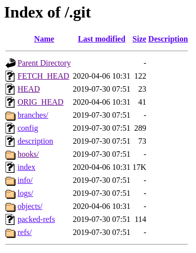

# Git Exposed

Git Exposed is a powerful tool for ethical hacking. It leverages the unintended exposure of `.git` directories on web servers to clone and reconstruct complete projects. This tool is designed to provide a clear window into potential vulnerabilities.



## Getting Started

These instructions will get you a copy of the project up and running on your local machine for development and testing purposes.

### Prerequisites

- Bash
- Git
- wget or curl

Please ensure that these are installed and available on your PATH before running the script.

### Installing

To clone this repository to your local machine, use the following command:

```bash
git clone https://github.com/simonkoeck/git-exposed.git
```

Navigate into the cloned directory:

```bash
cd git-exposed
```

Ensure that the attack.sh script is executable:

```
chmod +x attack.sh
```

Now, you're ready to start using GitExposed.

### Usage

To use GitExposed, simply run the `attack.sh` bash script with the URL of the target as an argument. For example:

```bash
./attack.sh http://example.com
```

The script will then attempt to download the `.git` directory and reconstruct the project.

### Disclaimer

This tool is intended for ethical hacking and lawful testing purposes only. Always obtain proper authorization before conducting penetration testing. The authors of GitExposed are not responsible for any misuse of this tool or for any damage that might be caused by it.

### Contributing

We welcome contributions! Please see the CONTRIBUTING.md file for details on how to contribute.

### License

This project is licensed under the terms of the MIT License. See the LICENSE file for details.
